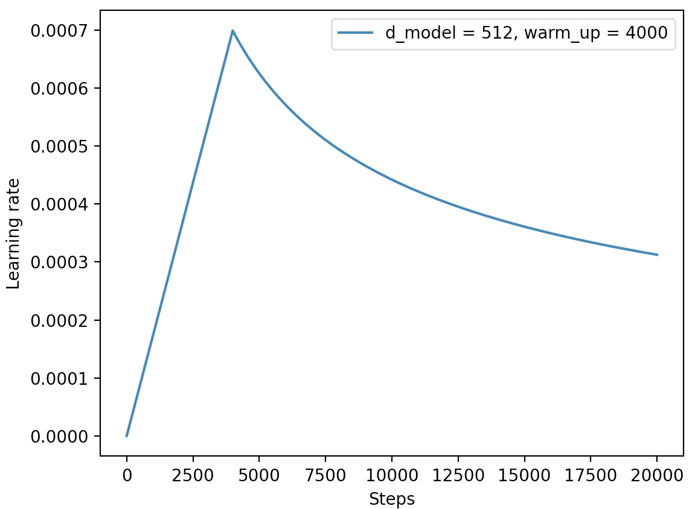

## A Transformer Framework Based Couplet Task
### 一个基于Transformer网络结构的对联生成模型


## 1. 环境准备
* Python==3.x
* PyTorch==1.5.0
* torchtext==0.6.0

## 2. 使用方法
* STEP 1. 直接下载或克隆本项目：https://github.com/moon-hotel/TransformerCouplet
* STEP 2. 可自定义修改配置文件`config.py`中的配置参数，也可以保持默认
### 2.1 训练
直接执行如下命令即可进行模型训练：
```
python train.py
```
训练过程：
```python
# 
```
学习率变化：



## 2.2 预测（inference）
直接运行如下命令即可：

```
python couplet.py
```

示例结果：

```python
# 
```
## 3. 结果
bleu评测结果

|val | test_2016_flickr |
|--|--|
| | |
